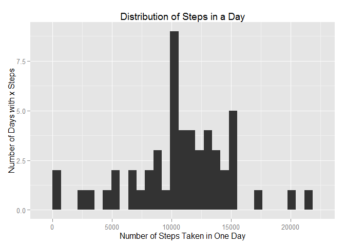
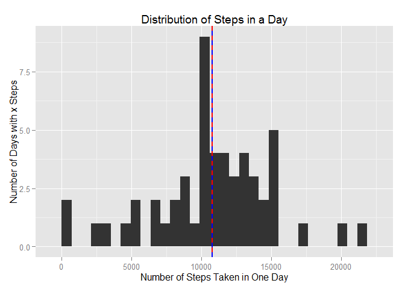
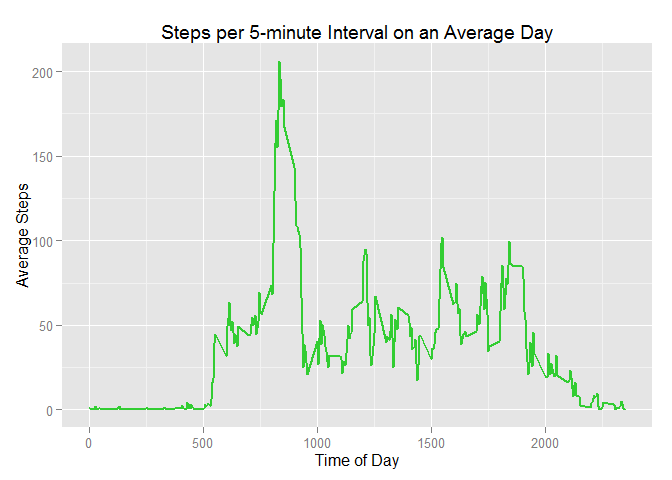
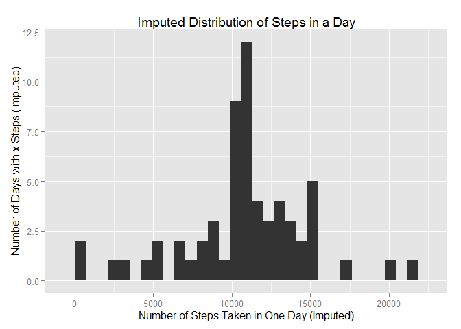
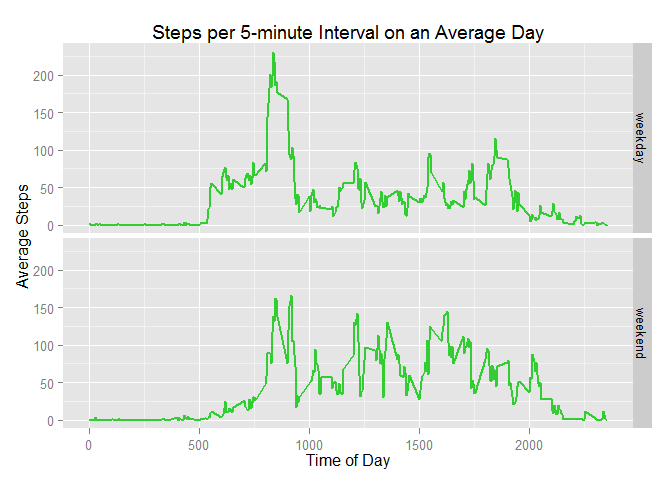

# Reproducible Research: Peer Assessment 1


## Quick Hello
Hi Reviewer!

Thanks for taking the time to consider my work. In case you wandered here by mistake, this is an assignment for the class "Reproducible Research" (repdata-016), which is offered by Johns Hopkins University via http://www.coursera.org.

From this point forward, I'll assume you're in the right place. One of the things I really like about R markdown is that it makes it very easy to show how the data is being transformed by the code in a step-by-step fashion. So, I'm taking this opportunity to go a little beyond the assignment by *showing* you what the code is doing rather than *telling* you what I think it's doing. The benefit is that there should be no question about *what* is actually happening or *whether* the code works. The risk to me is that the "big picture" might get lost in the details.

Ultimately, my goal is to make it as easy as possible for you to grade my assignment. So, I'll try to make the grade-able parts stand out for those of you who just want to rush through the checklist. Anything corresponding to one of the assessment questions is in **bold** (non-header) format and uses the language from the evaluation form as closely as possible. Aside from that, I'll do my best to make this entertaining.

One final important note before we proceed. Please take a moment to ensure you are looking at the `PA1_template.md` markdown file (and NOT the `PA1_template.Rmd` R markdown file) for the evaluation. This is important because only the .md file will render everything correctly in the browser on GitHub.

Happy reviewing!


## Loading and preprocessing the data
Since we're starting with a zipped file, we're going to need to unzip it first.  Following that, we will read the file and do some exploratory analysis. The exploratory results will give us a sense of whether any preprocessing is necessary. Last, we'll actually perform any needed preprocessing.

I'll assume, for convenience, that the activity.zip is in the same directory as this PA1_template.Rmd.

Note that the instructions for the evaluator at this point are to "Examine PA1_template.md" and find the code below. I hope you'll agree that "**There is code presented for reading in the data set.**"


```r
#Read in the data set
unzip("activity.zip") #Note overwrite=TRUE is the default.
data<-read.csv("activity.csv", colClasses=c("integer","Date","integer"))
```

Now, let's see what it looks like before we preprocess it.

```r
summary(data)
```

```
##      steps             date               interval     
##  Min.   :  0.00   Min.   :2012-10-01   Min.   :   0.0  
##  1st Qu.:  0.00   1st Qu.:2012-10-16   1st Qu.: 588.8  
##  Median :  0.00   Median :2012-10-31   Median :1177.5  
##  Mean   : 37.38   Mean   :2012-10-31   Mean   :1177.5  
##  3rd Qu.: 12.00   3rd Qu.:2012-11-15   3rd Qu.:1766.2  
##  Max.   :806.00   Max.   :2012-11-30   Max.   :2355.0  
##  NA's   :2304
```

```r
head(data)
```

```
##   steps       date interval
## 1    NA 2012-10-01        0
## 2    NA 2012-10-01        5
## 3    NA 2012-10-01       10
## 4    NA 2012-10-01       15
## 5    NA 2012-10-01       20
## 6    NA 2012-10-01       25
```

```r
str(data)
```

```
## 'data.frame':	17568 obs. of  3 variables:
##  $ steps   : int  NA NA NA NA NA NA NA NA NA NA ...
##  $ date    : Date, format: "2012-10-01" "2012-10-01" ...
##  $ interval: int  0 5 10 15 20 25 30 35 40 45 ...
```

At this point, "steps" and "date" make sense to me, but I want to take a closer look at "interval."


```r
head(data$interval, 30)
```

```
##  [1]   0   5  10  15  20  25  30  35  40  45  50  55 100 105 110 115 120
## [18] 125 130 135 140 145 150 155 200 205 210 215 220 225
```

Okay.  See the jump from 55 to 100 and from 155 to 200?  Interval isn't counting minutes.  It's the time on that day. Furthermore, since it begins at 0, we can be fairly confident that the identifer represents the beginning of the interval.  In other words, "0" means "12:00:00am - 12:04:59am."

This is good to keep in mind, but at least for now, I'm satisfied that no preprocessing of the data is necessary.

## What is mean total number of steps taken per day?
The instructions for this part are:

1. Make a histogram of the total number of steps taken each day.
2. Calculate and report the **mean** and **median** total number of steps taken per day.

### Massaging the data for the histogram
In order to accomplish #1, we need to take the sum all of the steps for each day.  Let's make this easy by using reshape2. First, we'll create a molten data frame where "steps" is the only measure variable, and then we'll use dcast to sum over the dates.  Note that we can set na.rm=TRUE because the assignment expressly says "For this part of the assignment, you can ignore the missing values in the dataset." We'll store the resulting data frame in a new variable, hist_data.

```r
library(reshape2)
hist_data<-melt(data, id=c("date", "interval"), na.rm=TRUE)
hist_data<-dcast(hist_data, date ~ variable, sum)
head(hist_data)
```

```
##         date steps
## 1 2012-10-02   126
## 2 2012-10-03 11352
## 3 2012-10-04 12116
## 4 2012-10-05 13294
## 5 2012-10-06 15420
## 6 2012-10-07 11015
```

Immediately, we can see that there was no data for the entirety of 2012-10-01.  Let's also take a moment to manually confirm that 12116 is the correct number of steps taken on 2012-10-04 as follows.

```r
data[864:865,] #beginning of 2010-10-04 is row 865
```

```
##     steps       date interval
## 864     0 2012-10-03     2355
## 865    47 2012-10-04        0
```

```r
data[1152:1153,] #end of 2010-10-04 is row 1152
```

```
##      steps       date interval
## 1152     0 2012-10-04     2355
## 1153     0 2012-10-05        0
```

```r
sum(data[865:1152,1])==12116
```

```
## [1] TRUE
```

Given our knowledge of R and the evidence above, we should now be in agreement that hist_data contains the correct values.

### The histogram we've all been waiting for
*"Make a histogram of the total number of steps taken each day."*

I'll be using the ggplot2 library for all of my plots in this assignment. Without further ado, **here's the histogram**.

```r
library(ggplot2)
hist<-qplot(hist_data$steps,
            xlab="Number of Steps Taken in One Day",
            ylab="Number of Days with x Steps",
            main="Distribution of Steps in a Day")
print(hist)
```

```
## stat_bin: binwidth defaulted to range/30. Use 'binwidth = x' to adjust this.
```

 

Notice that I also saved the plot object into the variable "hist" so that we can use it again later.

### Mean and Median Steps over Days
*"Calculate and report the mean and median total number of steps taken per day."*

I will re-word that requirement to better indicate my interpretation:
"Give the single mean and median taken over all days using the same data from the histogram." The key phrase in the requirement that leads to my interpretation is "total number of steps." Below, you will see that **"both the mean and median are reported"**.

```r
mean(hist_data$steps)
```

```
## [1] 10766.19
```

```r
median(hist_data$steps)
```

```
## [1] 10765
```


For fun, let's throw those lines onto the histogram.

```r
hist + geom_vline(aes(xintercept=mean(hist_data$steps)),
                  color="red", linetype="solid", size=1) +
       geom_vline(aes(xintercept=median(hist_data$steps)),
                  color="blue", linetype="dashed", size=1)
```

```
## stat_bin: binwidth defaulted to range/30. Use 'binwidth = x' to adjust this.
```

 

I decided not to add a legend because it should be clear from context what the lines mean and because ggplot() is much more suited to manual tweaks than qplot() is. In fact, Dr. Roger Peng indicated in the video lectures that it's best to use ggplot() instead of qplot() if you plan to make any manual adjustments.


## What is the average daily activity pattern?
The point of this part of the assignment is to determine at what time this person does the most walking/running on "an average day." For that, we need to plot a slightly different data set than for the previous section. Let's call this one "avgday_data."

Again, I'm ignoring NA values, as permitted.

```r
#library(reshape2) #Already loaded above.
avgday_data<-melt(data, id=c("date", "interval"), na.rm=TRUE)
avgday_data<-dcast(avgday_data, interval ~ variable, mean)
summary(avgday_data)
```

```
##     interval          steps        
##  Min.   :   0.0   Min.   :  0.000  
##  1st Qu.: 588.8   1st Qu.:  2.486  
##  Median :1177.5   Median : 34.113  
##  Mean   :1177.5   Mean   : 37.383  
##  3rd Qu.:1766.2   3rd Qu.: 52.835  
##  Max.   :2355.0   Max.   :206.170
```

```r
head(avgday_data)
```

```
##   interval     steps
## 1        0 1.7169811
## 2        5 0.3396226
## 3       10 0.1320755
## 4       15 0.1509434
## 5       20 0.0754717
## 6       25 2.0943396
```

```r
tail(avgday_data)
```

```
##     interval     steps
## 283     2330 2.6037736
## 284     2335 4.6981132
## 285     2340 3.3018868
## 286     2345 0.6415094
## 287     2350 0.2264151
## 288     2355 1.0754717
```

Alright, avgday_data looks like what we'd expect if the transformation was done correctly. Let's get to the plotting.  Here is **a time series plot of the average number of steps taken (averaged across all days) versus the 5-minute intervals**.  For fun, it's lime green, and I set size=1 so that it is easier to see.

```r
g<-ggplot(avgday_data, aes(interval,steps))
g + geom_line(color="limegreen", size=1) +
    labs(x="Time of Day", y="Average Steps",
         title="Steps per 5-minute Interval on an Average Day")
```

 

Judging from the graph, I'd guess this person goes for a morning jog on a fairly regular basis.

So, which 5-minute interval contains the maximum average number of steps? Well, we know that the maximum is 206.170 from our summary above the graph.  We also know from the graph that we expect the peak to fall between 8am and 9am. Here's the code to find it.

```r
#indicator is TRUE only for the row we want
indicator<-avgday_data$steps==max(avgday_data$steps)
avgday_data$interval[indicator] #The correct answer
```

```
## [1] 835
```

As seen above, **the 5-minute interval containing the maximum average number of steps** is the 8:35am-8:40am interval.

## Imputing missing values
"Imputing missing values" has four sub-sections:

1. Report number of NAs in original data set
2. Explain how I plan to fill in the missing NA values with numbers
3. Actually go ahead and fill in the missing NA values with numbers
4. Repeat everything from the histogram section with the filled-in data

I already reported the NAs way at the beginning with summary(data), but let's do it a different way this time.

```r
numNA<-sum(is.na(data$steps))
numNA
```

```
## [1] 2304
```
There we go.


### How I'll fill in the NAs with numbers
The assignment indicates "the strategy need not be sophisticated." Before we devise a strategy, though, let's take a closer look at how the NAs are distributed within the data set.

Which dates have NA values?

```r
missingdates<-unique(data[is.na(data$steps),2])
missingdates
```

```
## [1] "2012-10-01" "2012-10-08" "2012-11-01" "2012-11-04" "2012-11-09"
## [6] "2012-11-10" "2012-11-14" "2012-11-30"
```

Okay, only 8 dates and a total of 2304 NA values. Wait a minute. We don't have scattered NA values; we have entire days without data!  Check it out:

```r
#Number of 5-minute intervals in a day
fiveMinInts<-24*60/5

#Number of NAs per date with missing data
NAsPerMissingDay<-numNA/length(missingdates)

#These two are equal only if the entire day is missing for all 8 days
fiveMinInts
```

```
## [1] 288
```

```r
NAsPerMissingDay
```

```
## [1] 288
```
There you have it. That's going to limit the strategies that we can apply.


With the above information, I'll use the example strategy of filling in the NAs by using the mean for the interval over all days. In other words, my **description of a strategy for imputing missing data** is that I will replace each NA value with the corresponding average for that interval from avgday_data, rounded to the nearest integer (i.e. no decimals).  Since this strategy was taken directly from a suggestion in the instructions, it should be allowable as long as it is possible.

### Create the new data set with filled-in values
Here's the code that does the work of defining a new "imputed_data" dataset according to the strategy above. Following these two lines of code is an explanation of why it works.

```r
imputed_data<-data #First make a copy
imputed_data$steps[is.na(imputed_data$steps)]<-round(avgday_data$steps)
```

The cool thing about the above code is that it works exactly because the NAs are distributed into entire-day blocks and because R does that nice "vector recycling" thing. As shown previously, each day has 288 5-minute intervals, and each missing day therefore has 288 NA values. Importantly, the intervals are in the same order (0, 5, 10, etc.) in both `imputed_data` and `avgday_data`, so the assignment of values acts the way that we want it to instead of scrambling everything around.  But, enough talk.  How about some proof?

Proof that We filled in all of the NA values:

```r
sum(is.na(imputed_data$steps))
```

```
## [1] 0
```
It's zero, so there are no NAs left.

Proof that the non-NA data is exactly the same:

```r
NAorig<-is.na(data$steps)
sum(!imputed_data[!NAorig,]==data[!NAorig,])
```

```
## [1] 0
```
Again, it's zero, so all non-NA rows from the original data set are exactly equal to their corresponding rows in the imputed data set.

Lastly, proof that the data mapped correctly onto the NA values:

```r
#Basically, this is an equivalent way to assign the values.
newvalues<-rep(round(avgday_data$steps), length(missingdates))
sum(!imputed_data$steps[NAorig]==newvalues)
```

```
## [1] 0
```
Zero again. All's good in the neighborhood. :)

### Histogram, Mean, and Median with Imputed Data
As mentioned earlier, this part is just a repeat of the first histogram, mean, and median with the added twist that it uses the imputed data set.  So, I copy pasted the R markdown sections `reshapeForHistogram1` and `histogram1` and then replaced these variable names with new ones: hist_data, data, hist. I also removed the na.rm=TRUE option because we no longer need it.


```r
#library(reshape2) #Already loaded
hist_data_i<-melt(imputed_data, id=c("date", "interval"))
hist_data_i<-dcast(hist_data_i, date ~ variable, sum)
head(hist_data_i)
```

```
##         date steps
## 1 2012-10-01 10762
## 2 2012-10-02   126
## 3 2012-10-03 11352
## 4 2012-10-04 12116
## 5 2012-10-05 13294
## 6 2012-10-06 15420
```

...and here is the **histogram of the total number of steps taken each day after missing values were imputed**.

```r
#library(ggplot2) #Already loaded
hist_i<-qplot(hist_data_i$steps,
            xlab="Number of Steps Taken in One Day (Imputed)",
            ylab="Number of Days with x Steps (Imputed)",
            main="Imputed Distribution of Steps in a Day")
print(hist_i)
```

```
## stat_bin: binwidth defaulted to range/30. Use 'binwidth = x' to adjust this.
```

 


Also, the instructions call for calcuating and reporting the mean and median again as well as some "thinking out loud" about the impact of tweaking the data, but there is no corresponding grading criteria. When I'm grading someone else, I won't require this part, but here it is anyway.

```r
mean(hist_data_i$steps)
```

```
## [1] 10765.64
```

```r
median(hist_data_i$steps)
```

```
## [1] 10762
```

Not surprisingly, these estimates do differ from the first part of the assignment. The new mean is closer to the previous median, and the new median has dropped. This is because the (rounded!) number of steps in our interval-averaged day is less than the average number of steps in a day (as computed with the ORIGINAL non-imputed data).  I'll rephrase that last sentence in code for clarity.

```r
#NOTE: I'm intentionally comparing the non-imputed data sets.
sum(avgday_data$steps) == mean(hist_data$steps) #Equal without rounding
```

```
## [1] TRUE
```

```r
sum(round(avgday_data$steps)) < mean(hist_data$steps) #Rounding has an effect
```

```
## [1] TRUE
```

```r
sum(round(avgday_data$steps)) - sum(avgday_data$steps) #How much of an effect?
```

```
## [1] -4.188679
```
So, my decision to round the numbers had a measurable impact. Pretty good lesson there about the dangers of rounding. Now, I'm even happier about the decision to round because it gave this assignment some additional value.

The other lesson here is more general: Be very careful about imputing data. It's easy to get it wrong and ruin your analysis. If you are going to impute data, then do a really thorough analysis of the non-imputed data, make sure to contextualize your use of the imputed data (i.e. certain strategies will be okay for some specialized needs but not for others), and document everything for the world to see.

## Are there differences in activity patterns between weekdays and weekends?
Almost done! Now is the part where we add a new column to the imputed data set that indicates whether it's a weekday or weekend, and then we use it to compare weekday versus weekend activity using a top-bottom time-series panel plot.

Here's the code to add the new column to the imputed data.

```r
#Logical indicator. TRUE for weekend days.
weekend<-weekdays(imputed_data$date) %in% c("Saturday","Sunday")
weekend<-as.factor(weekend)
levels(weekend)
```

```
## [1] "FALSE" "TRUE"
```
Notice that the levels are FALSE, TRUE and that we want to assign "weekday" to FALSE and "weekend" to TRUE.  Let's do that explicitly and then add the new weekend factor directly to the imputed data set.


```r
levels(weekend)<-c("weekday","weekend")
imputed_data$weekend<-weekend
head(imputed_data)
```

```
##   steps       date interval weekend
## 1     2 2012-10-01        0 weekday
## 2     0 2012-10-01        5 weekday
## 3     0 2012-10-01       10 weekday
## 4     0 2012-10-01       15 weekday
## 5     0 2012-10-01       20 weekday
## 6     2 2012-10-01       25 weekday
```

```r
#For good measure, let's also pick a weekend and show that it's labeled right.
imputed_data[1440:1441,]
```

```
##      steps       date interval weekend
## 1440     0 2012-10-05     2355 weekday
## 1441     0 2012-10-06        0 weekend
```


With the observations appropriately labeled, the next step is to compute the "average weekday" and "average weekend" values for each interval (like we did much earlier for the "average day" time series).

```r
#library(reshape2) #Already loaded above.
avgday_data2<-melt(imputed_data, id=c("date", "interval", "weekend"))
avgday_data2<-dcast(avgday_data2, interval + weekend ~ variable, mean)
summary(avgday_data2)
```

```
##     interval         weekend        steps        
##  Min.   :   0.0   weekday:288   Min.   :  0.000  
##  1st Qu.: 588.8   weekend:288   1st Qu.:  2.106  
##  Median :1177.5                 Median : 28.125  
##  Mean   :1177.5                 Mean   : 38.987  
##  3rd Qu.:1766.2                 3rd Qu.: 61.230  
##  Max.   :2355.0                 Max.   :230.356
```

```r
head(avgday_data2)
```

```
##   interval weekend     steps
## 1        0 weekday 2.2888889
## 2        0 weekend 0.2500000
## 3        5 weekday 0.4000000
## 4        5 weekend 0.0000000
## 5       10 weekday 0.1555556
## 6       10 weekend 0.0000000
```

```r
tail(avgday_data2)
```

```
##     interval weekend     steps
## 571     2345 weekday 0.3111111
## 572     2345 weekend 1.7500000
## 573     2350 weekday 0.2666667
## 574     2350 weekend 0.0000000
## 575     2355 weekday 1.4000000
## 576     2355 weekend 0.1250000
```


Looking good! Let's graph it. Here is **a panel plot comparing the average number of steps taken per 5-minute interval across weekdays and weekends**.

```r
#library(ggplot2) #Already loaded above
g2<-ggplot(avgday_data2, aes(interval, steps))
g2 + geom_line(color="limegreen", size=1) +
    facet_grid(weekend ~ .) +
    labs(x="Time of Day", y="Average Steps",
         title="Steps per 5-minute Interval on an Average Day")
```

 

So, it appears that this individual does most of their walking/running on weekdays. Note here that the dissimilarities between the above plot and the example plot are due to two factors: use of ggplot2 rather than lattice, and use of the actual data set rather than randomized simulated data.

## Conclusion
Thanks again for taking the time to review. I'm confident that I have done everything required to receive full credit, and I hope you will agree. Beyond that, I will absolutely appreciate any constructive, kind feedback you can offer about ways to improve organization, further clarify intent, or otherwise create a better experience for future reviewers.

Thanks!
